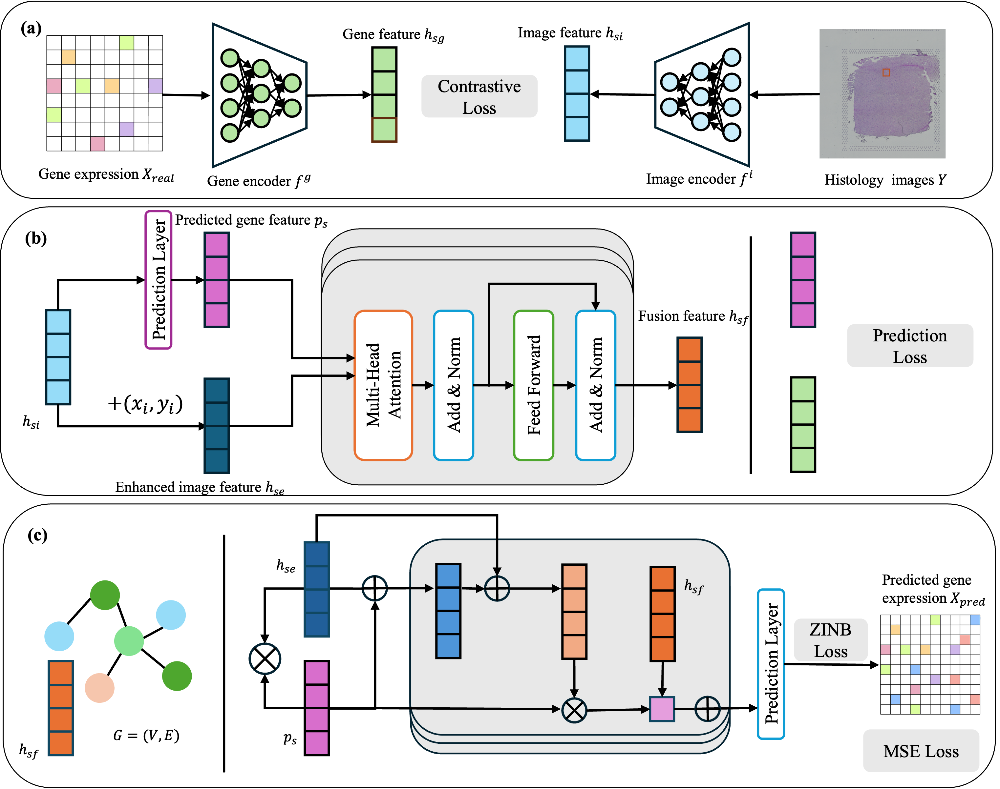
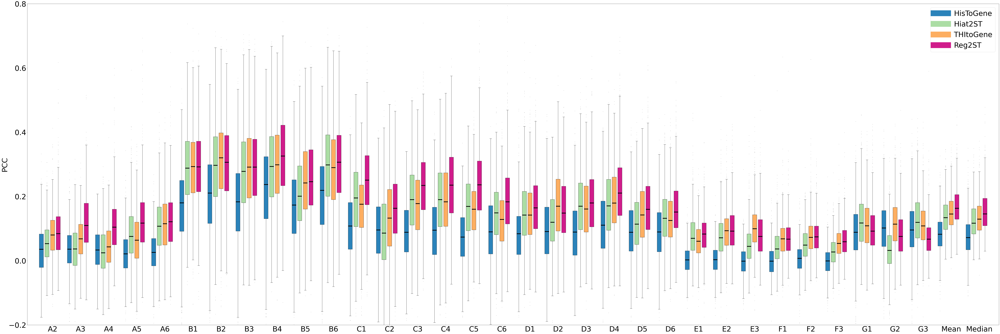
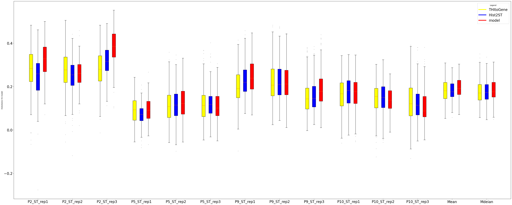

# Reg2ST: Recognizing potential patterns from gene expression for spatial transcriptomics prediction

## Overview
Reg2ST is a deep learning framework designed to predict
spatial transcriptomics from histology images by integrating
gene expression patterns using contrastive learning method. It
contains feature extraction module, feature fusion module and
dynamic graph neural network.


## Framework of Reg2ST


## Dataset
1. the human HER2-positive breast cancer (HER2+) dataset: containing 36 sections from 8 patients.
2. the human cutaneous squamous cell carcinoma (cSCC) dataset: containing 12 sections from 4 patients.

## Results





| Model       | Mean PCC (HER2+) | Mean PCC (cSCC) | Median PCC (HER2+) | Median PCC (cSCC) |
|-------------|------------------|------------------|---------------------|---------------------|
| HisToGene   | 0.0831           | 0.0775           | 0.0770              | 0.0785              |
| Hist2ST     | 0.1504           | 0.1819           | 0.1353              | 0.1780              |
| THIToGene   | 0.1390           | 0.1810           | 0.1249              | 0.1746              |
| HGGEP       | | | |
| Reg2ST      | **0.1741**       |  **0.2021**      |  **0.1616**         |  **0.1911**         |

Reuslts of ablation study and parameter sensitivity are in folder `results`.

## Usage
1. Clone the repository

```shell
git clone https://github.com/Holly-Wang/Reg2ST.git
cd Reg2ST
```

2. Install the required dependencies, run:
```shell
conda create -n reg2st python=3.9
pip install -r requirements.txt
```

3. Prepare the dataset
```shell
# Download Reg2ST dataset, which contains spatial transcriptomics and phikonv2 embedding of HER2+ and cSCC datasets.
cd data
bash download.sh
```

4. Train the model
```shell
cd code
python train.py --fold=$i  --device_id=0  --epochs=<EPOCHS> --dataset='her2st'
```
5. Predict
```shell
cd code
python predict.py --fold=0  --device_id=0 --dataset='her2st'
```

## Checkpoints
You can download Reg2ST checkpoints on [her2st_models](https://drive.google.com/file/d/1TtPt7HNGV5OVWjk3Fa0u_P0lCqsMuYqA/view?usp=sharing) and [skin_models](https://drive.google.com/file/d/1cSGAWnR5MlnH5m0FPxoharBzbj3qR0c3/view?usp=sharing).

## Getting Started
- For train and test Reg2ST, please see [tutorials](tutorial/Reg2ST_train_test.ipynb).
- For Wilcoxon signed rank test, please see [Wilcoxon signed rank test](tutorial/wilcoxon-test.ipynb).


## Structure of Reg2ST
<pre>
<code>
├── baselines
│   └── README.md
├── code
│   ├── __init__.py
│   ├── attention.py  # cross attention module 
│   ├── herst.py  # data handler of HER2+ ans cSCC 
│   ├── loss.py  # loss funtion used in Reg2ST
│   ├── model.py  # Reg2ST model
│   ├── performance.py  # code of PCC metric
│   ├── pikon.py  # code of generating phikon embeddings
│   ├── predict.py  # prediciton code
│   ├── train.py  # train code
│   ├── utils.py  # utils
│   └── wikg.py  # WiKG module
├── data
│   └── download.sh
├── model.png
├── README.md
├── requirements.txt
├── result
│   ├── abi-her2st-mean.png
│   ├── abi-her2st-median.png
│   ├── abi-skin-mean.png
│   ├── abi-skin-median.png
│   ├── hyper-her2st-embedding.png
│   ├── hyper-her2st-wikg.png
│   ├── hyper-skin-embedding.png
│   ├── hyper-skin-wikg.png
│   ├── res_cscc.png
│   └── res_her2st.png
└── tutorial
    ├── Reg2ST_train_test.ipynb
    └── wilcoxon-test.ipynb
</code>
</pre>
